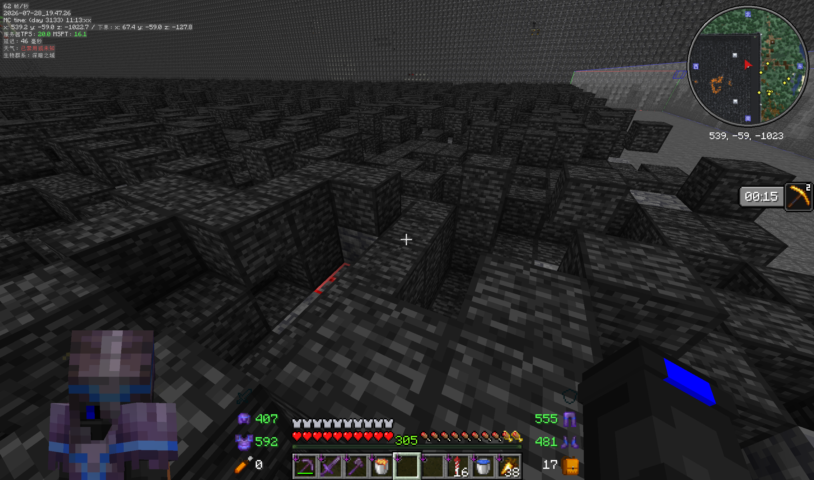
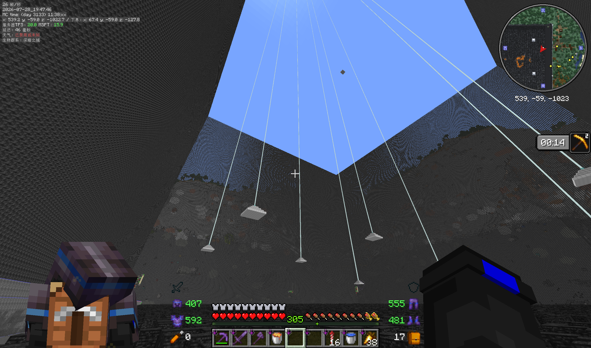
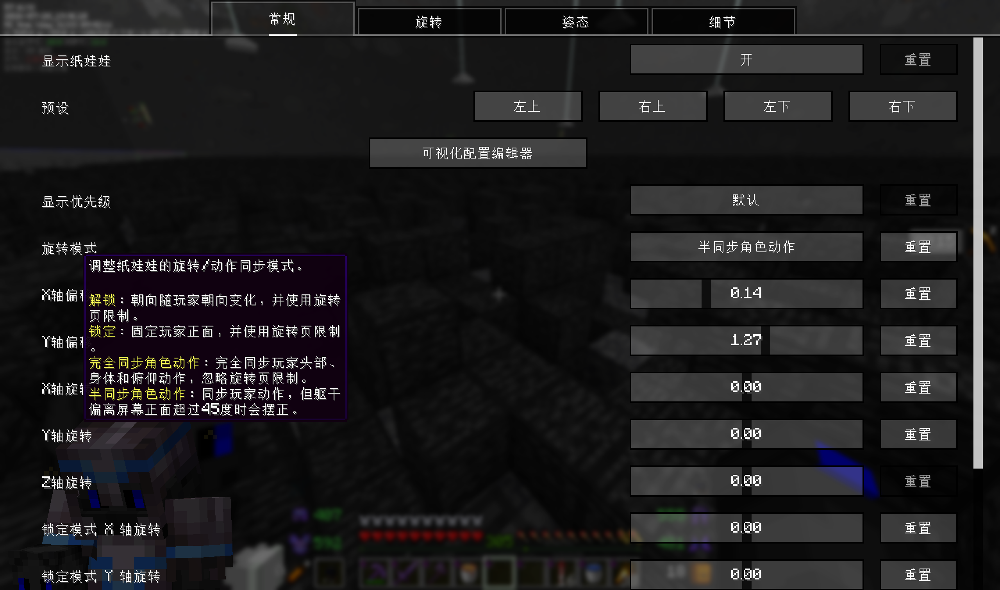
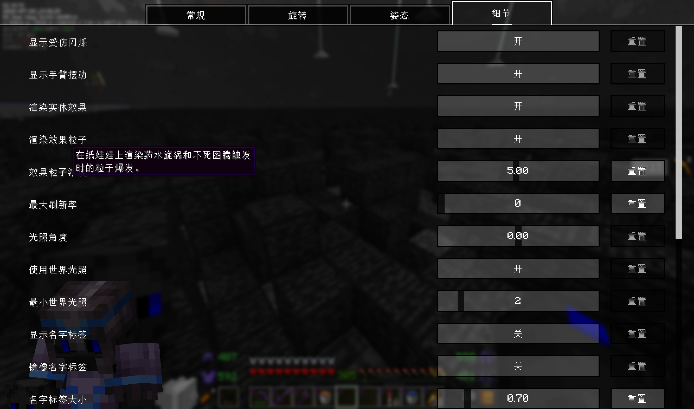

# Ayame PaperDoll:JohnMuyuan Edition

一个高度可配置的 Minecraft 纸娃娃（PaperDoll）HUD 模组，面向 **Minecraft 26.1**，支持 **Fabric** 与 **NeoForge** 双加载器。在屏幕角落实时渲染你的玩家模型，并提供极其丰富的自定义选项与可视化编辑器。

**Ayame PaperDoll:JohnMuyuan Edition** 是 **Ayame PaperDoll**（作者 HappyRespawnanchor）的 Minecraft 26.1 魔改版，技术渊源可追溯至 **Extra Player Renderer**（原作者 LucunJi）。代码在 LGPL-3.0-or-later 下授权，详见[许可证](#许可证)。

> [!NOTE]
> 本模组与上游 Ayame PaperDoll 使用相同的内部 Mod ID（`ayame_paperdoll`），二者**不可同时安装**；配置文件互相兼容，可直接替换使用。

## 功能总览

- 屏幕任意角落（或自定义偏移）渲染纸娃娃，预设四角一键切换
- 丰富的配置界面：可通过模组菜单（Mod Menu / NeoForge 模组列表）或按键绑定打开
- 显示/隐藏切换快捷键（默认 **F8**）
- 可视化配置编辑器：拖拽调位置、右键调旋转、滚轮调大小
- 旋转模式：解锁（Unlock）、锁定（Lock）、完全同步玩家动作、半同步玩家动作
- 名牌渲染：独立镜像、大小、偏移均可调
- 姿态偏移：潜行 / 游泳 / 爬行 / 鞘翅飞行时的 Y 轴补偿
- 世界光照着色、受伤闪红、挥手动作、药水/图腾粒子
- 渲染帧率限制，降低性能开销

## 与上游 Ayame PaperDoll 的功能差异

以下内容基于与上游 `26.1` 分支的代码对比整理。

### 新增功能

| 功能 | 说明 |
|------|------|
| **显示优先级** | 三档可调：默认（原 HUD 层）/ 高（绘制在聊天、字幕等 HUD 之上）/ 最高（绘制在绝大多数游戏界面之上，ESC 暂停菜单除外） |
| **新旋转模式** | 完全同步玩家动作（FULL_SYNC）：头、身、俯仰完全跟随真实玩家，忽略旋转范围限制；半同步（HALF_SYNC）：同步动作，但躯干偏转超过约 45° 时自动回正 |
| **锁定模式独立旋转** | Lock 模式下纸娃娃朝向使用一套独立的 X/Y/Z 旋转参数，与普通旋转互不影响；可视化编辑器中右键拖动即可调整 |
| **名牌显示** | 可在纸娃娃上显示玩家名与计分板标签；支持独立镜像开关（模型镜像时保持文字可读）、大小缩放（0 为隐藏）、XY 偏移微调 |
| **实体效果渲染** | 可选渲染着火、隐身、受伤红覆盖等实体绑定效果；着火时纸娃娃随燃烧变亮 |
| **效果粒子** | 纸娃娃上自绘药水旋涡粒子与不死图腾爆发粒子，粒子密度可调（上限 256） |
| **最大刷新率限制** | 0–240 可调（默认 60，0 为不限）；限制间隔内复用上一帧离屏纹理，避免重复渲染实体，显著降低性能开销 |
| **配置兼容迁移** | 自动将旧版配置中的历史布尔键（如 `full_sync_motion` 等 9 种）迁移到新的旋转模式枚举 |

### 修改的功能

- **渲染管线重构**：离屏纹理不再按全屏分配，改为按纸娃娃实际包围盒动态分配（鞘翅飞行、名牌显示时自动扩展），只绘制有效区域，减少显存占用
- **镜像渲染**：镜像状态从读取全局配置改为按渲染状态传递；镜像 + 名牌可读时拆分为两次渲染（模型一次、名牌一次），保证文字不反
- **着火/发光处理**：不再通过清除火焰 tick 来隐藏火焰（改由实体效果开关控制）；轮廓发光始终禁用（画中画限制下会产生白色剪影）；隐身实体转为半透明可见
- **观察者模式**：玩家名为空时直接使用本地玩家，跳过玩家列表查询
- **可视化编辑器交互**：Shift+左键拖动调整名牌偏移；右键拖动同时调 X/Y 旋转（原来只有 Y）；新增 Ctrl+右键调 Z 轴旋转
- **配置读取容错**：遇到未知配置类别/选项/枚举值时跳过并保留默认值，不再直接抛异常
- **中文翻译全面润色**：简中/繁中语言文件措辞统一、标点规范

### 删除的功能

- **坐骑渲染**（`render_vehicle`）：移除了整套载具渲染逻辑及配置项（上游该特性本就不完善）
- **坐船 180° 旋转修正** 的特判代码一并移除
- 移除了指向官方 Modrinth 的自动更新检查（NeoForge `updateJSONURL`）

## 截图









## 安装

从 [**Releases**](https://github.com/JohnMuyuan/Ayame-PaperDoll/releases/latest) 下载对应加载器的 jar，放入 `mods` 文件夹：

- **Minecraft**：26.1
- **Fabric**：Fabric Loader ≥ 0.18.5 + Fabric API ≥ 0.144.3+26.1（可选装 Mod Menu 以便打开配置界面）
- **NeoForge**：≥ 26.1.0.7-beta

## 自行构建

需要 **JDK 25**：

```bash
./gradlew build
```

产物位于 `fabric/build/libs/` 与 `neoforge/build/libs/`。

## 版本号规则

格式为 `x.y.z+26.1`，从 `1.0.0` 起步独立编号，不沿用上游版本号。变更记录见 [CHANGELOG.md](CHANGELOG.md)。

## 致谢

- **LucunJi** —— 原始模组 [Extra Player Renderer](https://modrinth.com/mod/extraplayerrenderer) 作者
- **HappyRespawnanchor** —— [Ayame PaperDoll](https://github.com/AyameMC/Ayame-PaperDoll) 作者，本模组以其 26.1 分支为技术起点
- Fallen_Breath、X-Green、altrisi、plusls、pertaz、LightgraycaAT —— 上游贡献者
- **JohnMuyuan** —— 本版本的维护与开发

## 许可证

**LGPL-3.0-or-later**，与上游保持一致。上游代码版权归 LucunJi、HappyRespawnanchor 及贡献者所有；本版本的修改与新增代码版权归 JohnMuyuan 所有。详见 [LICENSE](LICENSE)、[COPYING](COPYING)、[COPYING.LESSER](COPYING.LESSER) 与 [licenses/](licenses)。
